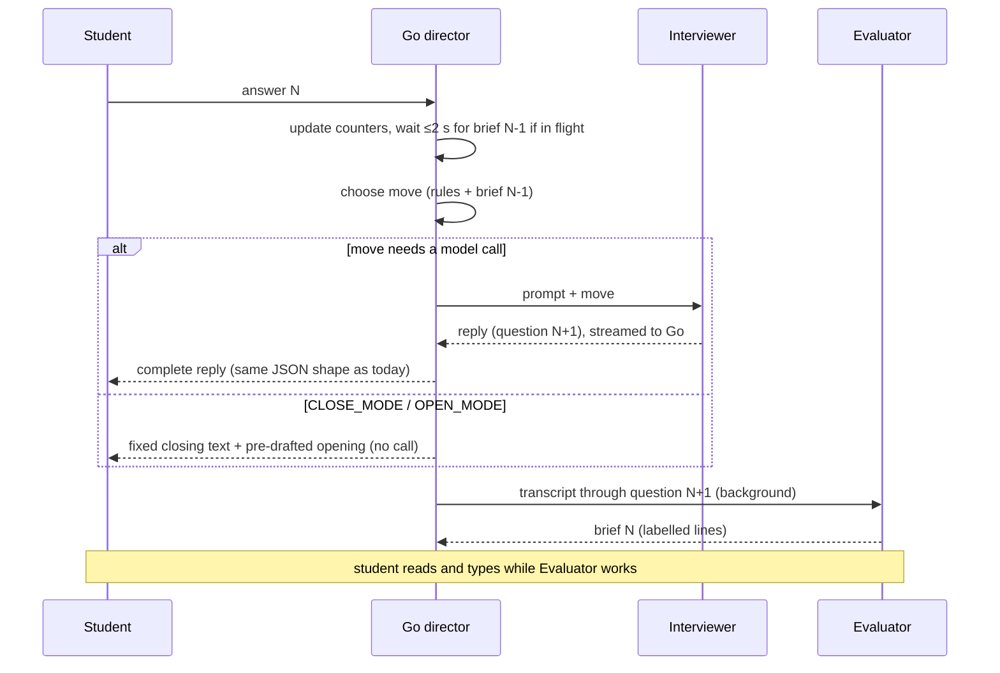

# iPyInterVu D5 Design: Interviewer + Evaluator

_Status: Phase 1 implemented behind `IPY_ENGINE=d5` · 2026-10-01_

## 1. Summary

Split the single do-everything model call into two roles:

- a fast **Interviewer** that writes the reply the student is waiting for;
- a thorough **Evaluator** that runs while the student is typing.

The Go server owns every flow decision. Target: every student-visible reply in **≤ 10 s**, typically 3–6 s on today's provider.

**Requirements kept from today**
- Conversational job-interview feel.
- Questions respond to each answer.
- Focus on the student's major.
- Rubric-grounded assessment.
- Scenarios generated live for each session.

**Out of scope**
- Pre-planned question banks (they read as a quiz).
- Fine-tuning.
- Executing student code.

**Decisions already made**
- Per-turn evaluation runs live but one turn behind; that lag is accepted.
- A mode may occasionally run one question longer than ideal.
- The Evaluator pre-drafts the next mode's opening material.
- Personas are canned rather than generated: one interviewer per phase, with the name drawn per session from a pool (§4.1).
- No JSON in prompts or responses. Model output uses short labelled lines that Go parses (§5).
- **Coaching is available only after results.** A coaching request during the assessment gets a fixed server reply, "Coaching opens once the interview is finished.", and the interview continues. `CoachingEnteredBeforeResults` and the resume-after-coaching logic are removed.
- **Question limits stay as they are:**
    - Conceptual: 3–5 questions (`maxConceptualQuestions`).
    - Code: 3 questions after code is pasted (`maxPostCodeQuestions`).
    - Bug: 4 questions (`maxBugQuestions`).
    - 2 vague answers (`maxVagueAnswers`) or 2 similar questions (`maxSimilarQuestionAsks`) close the mode.
- **Both engines live in one binary during the build.** The work happens on a branch, with the engine chosen by `IPY_ENGINE` (old by default) and deployed to staging only. The old code is deleted only in Phase 4.
- **Tone: a warm, professional interviewer** who responds naturally to each answer. It never says whether an answer was right, never teaches, and never hints. The old "Got it."-only neutrality was a workaround in the old code and is dropped.
- **Rule decisions** (from `D5-rules-checklist.md`):
    - No instructor-voice exception for education majors; every major gets company interviewers.
    - One "give me a concrete detail" redirect per mode after a vague answer is allowed. The second vague answer closes the mode.
    - Grading (full spec in `grading-rules.md`): the lowest label wins, Code dimensions with no evidence are ignored, and a vague answer is labelled Not Ready.
    - Code mode asks for problem decomposition first, then for the code. The task is framed as the data available and what is wanted (§5).
    - The request for code tells the candidate AI tools may be used.
    - The ban on prompting for `while True`, `break` and `continue` applies in weeks 7, 8 and 9.
    - Evidence behind each bucket is explained in coaching, not in the results message.
    - The coach is a mentor at the same company.
- **Personas:**
    - Roles: hiring manager (Conceptual), software developer (Code), QA engineer (Bug), mentor (Coaching).
    - One company for the whole session.
    - No pronouns; interviewers speak only in the first person, and prompts never refer to them as he or she.
- **Grading is done in Go.** The model only labels each answer with rubric levels. Go turns those into mode buckets and the final rating, and builds the results message (§8).
- **Rubric descriptions are kept apart from grading rules.**
    - The weekly rubrics hold level descriptions only, for the Evaluator.
    - The rules live in a spec, `grading-rules.md`, hard-coded in `grading.go` and never sent to a model.
    - `final_assessment_rubric.md` is retired (§8.1).
- **The current user interface and the public/private key admission are retained unchanged.** `static/` needs no changes. `/api/chat` keeps its request and response contract: the same OpenRouter completion shape, the turn-ID header and turn recovery. The RSA challenge/verify login and session cookie (`auth.go`, `session.go`, `keys.go`) stay as they are. All D5 work happens behind `/api/chat`.

### Why the current design can't hit 10 s

Production logs from 2026-10-01 show that call time tracks **response size**, not prompt size. Output arrives at about 200 bytes/s (~50 tokens/s).

| Response body | Call time | Approx. output tokens |
| --- | --- | --- |
| 1.1–1.7 KB | 1.7–7 s | 150–300 |
| 3.9–5.7 KB | 16–28 s | 900–1,300 |
| 7.5–9.7 KB | 19–48 s | 1,800–2,300 |
| 11–15.8 KB | 35–84 s | 2,700–3,800 |

Calls that carried the full prompt but returned a short reply finished in under 3 s, so prefill is cheap. The time goes to three things:

1. Replies are 10–30× longer than an interview turn needs.
2. Corrective retries cause 2–4 sequential calls per message, which produced chats of 84–209 s.
3. 120 s timeouts are retried up to 3×; one chat took 296 s.

At ~50 tokens/s, 10 s buys about 400–500 output tokens in total. The live path must therefore produce **one short reply, once**.

## 2. Architecture

```
                     ┌─────────────────────────── Go server (director) ───────────────────────────┐
 Student ──answer──► │ session state · transcript · counters · move selection · mode transitions  │
    ▲                │        │                                          ▲                         │
    │                │        │ prompt (~1.5–2.5K tok) + move              │ brief (text lines)      │
    │                │        ▼                                          │                         │
    └─────reply──────┤  [Interviewer]  ── live path, ≤300 tok out   [Evaluator] ── background      │
                     │   plain text, no reasoning                    labelled lines, reasoning on    │
                     │                                               rubric + competency guide       │
                     │                                               + next-mode opening drafts      │
                     └────────────────────────────────────────────────────────────────────────────┘
```

| Component | Responsibility | On critical path? |
| --- | --- | --- |
| **Go director** | Owns state, transcript, counters and caps. Picks the next *move*. Owns forward-only mode transitions and setup flow. Computes mode buckets, the final rating and the results text (§8). | Yes (microseconds) |
| **Interviewer** | Turns a move plus context into one natural reply: a brief reaction and one question, in persona. | Yes |
| **Evaluator** | Reads the full transcript against the rubric. Produces the brief that steers the next turn, including rubric levels for the latest answer and rule-issue notes. Drafts the next mode's opening. It never assigns a bucket. | No (runs while the student types) |

The model no longer controls state. Nothing in model output drives transitions except the Evaluator's labelled-line brief. Go parses that brief tolerantly and treats it as advisory; the director decides.

## 3. Turn lifecycle and latency budget



| Step | Typical provider (~50 tok/s) | Fast provider (optional) |
| --- | --- | --- |
| Wait for in-flight brief (worst case) | ≤ 2.0 s | ≤ 2.0 s |
| Interviewer prefill (~2K tokens) | 0.5–1.0 s | < 0.3 s |
| Interviewer output (~120 tokens) | ~2.5 s | < 0.3 s |
| **Total per turn** | **~3–6 s** | **~1–3 s** |
| Mode transition (pre-drafted, no call) | < 0.1 s | < 0.1 s |
| Last mode closing + results (levels for the final answer, then Go grading) | 1–3 s | < 1 s |
| First conceptual opening (live, ≤300 tokens) | 4–7 s | 1–2 s |

**Measured 2026-10-01** with `tools/modelcheck` against `deepseek/deepseek-v4-flash-0731`, using a ~1,400-token interviewer prompt with reasoning off:

| Routing | Total time, p50 | Total time, max | Time to first token, p50 | Output speed, p50 |
| --- | --- | --- | --- | --- |
| Default | 1.48 s | 2.52 s | 1.30 s | 89 tok/s |
| `provider.sort: "throughput"` | 1.08 s | 2.05 s | 0.92 s | 125 tok/s |

The test replies were only 15–34 tokens. Warmer 1–2 sentence replies of ~100 tokens should add roughly 1 s at these speeds, keeping turns around 2–4 s. Prefix caching was active on some providers: 1,413 of 1,417 prompt tokens were cached.

The first conceptual opening is the slowest turn. It is the only live generation of a scenario, because there is no previous mode for the Evaluator to draft it in. Canned personas shorten it: the model writes only a one-line company name and domain, the scenario and one question. The server writes the introduction (§4.1).

## 4. Interviewer call

**Output contract**
- Plain text, under ~90 words.
- A brief, natural, warm response to the answer (one or two sentences), then exactly one question.
- No fence, no JSON, no headings.
- `max_tokens: 250`. Raise to 300 for the first opening and 400 for coaching.
- `stop` sequences for simulated replies: `"\nStudent:"`, `"\nCandidate:"`, `"\nYou:"`, `"\nA:"`.
    - **Measured:** one provider (DeepInfra) ignored them. The request therefore sets `provider.require_parameters: true`, so OpenRouter routes only to providers that support every parameter sent.
    - Go also watches the stream itself: when `findSimulatedStudentIndex` matches, it cuts the reply there and cancels the request. Stop sequences are never the only safeguard.
- Streamed from OpenRouter to Go only. Streaming lets the server enforce the first-token timeout and read the `COMPANY:` line early. The browser receives the complete reply in today's response shape, so the UI is unchanged. Total time is the same either way; only the gradual display would differ, and that would need UI changes.

**Inputs**
- The canned persona for the current phase (§4.1), and the company line from the first opening.
- Student major.
- Allowed concepts for weeks 1..N.
- The current scenario, code task or bug snippet.
- The last ~6 transcript messages.
- From the latest brief: `NEXT`, `AVOID`, and `ISSUES` (as corrections).
- The move instruction.

**System prompt template.** The static part comes first so prefix caching can hit.

```
You are {persona_name}, {persona_role} at {company_name} ({company_domain}).
You are interviewing a candidate with a {student_major} background for an entry-level
role that uses Python.

How you speak:
- A warm, professional interviewer and a colleague at the company, not a teacher.
  Never mention weeks, courses, classes, homework, or what the candidate has studied.
- Respond naturally to what the candidate just said in one or two sentences, then ask
  exactly ONE question. Then stop.
- Never say whether an answer was right, explain, hint, give sample answers, or answer
  your own question. Never write the candidate's reply.
- Use only details the candidate actually gave. Don't introduce yourself again,
  restate the scenario, or say you are moving on or wrapping up.
- Use only these Python ideas: {allowed_concepts}. Never mention any other Python
  feature, even to rule it out. Never mention dictionaries.{loop_note}
- Plain text, under 90 words.

--- (dynamic below this line) ---
Scenario: {scenario_or_task}
Colleague's private notes: {NEXT}. Do not re-ask: {AVOID}. {ISSUES as corrections}
Your task for this reply: {move_instruction}
```

**Variants**, chosen by Go:
- **`{loop_note}` for weeks 7–9:** " Never ask for or suggest `while True`, `break` or `continue`; if the candidate uses them, ask why they chose that."
- **Week 1:** the second sentence becomes "…for an entry-level role. This conversation is about breaking real-world problems into inputs, steps and outputs; never discuss code or Python." The Python-ideas line is dropped.
- **First Conceptual opening:** the move instruction carries a one-line focus taken from `week{N}_key_concepts.md`, so the live opening targets this week's concept.

Size: the template is about 250 tokens. With the scenario, notes and 6 messages it comes to roughly 1.5–2.5K tokens. Today's instruction bundle is about 60 KB, and nothing like it is sent. The prompt is plain text throughout. It contains no state JSON; the brief's fields are inserted as sentences.

### 4.1 Canned personas

There is one interviewer per phase, replacing today's pairs (Alex/Julia, Taylor/Morgan, Riley/Casey, Samantha/David). Each phase's role is fixed. At week selection the server picks a name for each phase from a pool, using a per-session random seed, and stores it in state. The model never invents or chooses a persona. All four personas work at the one company from the first opening. Prompts never use pronouns for them.

| Phase | Role (canned) | Name pool (example) |
| --- | --- | --- |
| Conceptual | hiring manager | Alex, Jordan, Priya, Marcus, Elena, Sam |
| Code | software developer | Taylor, Diego, Mei, Noah, Aisha, Chris |
| Bug | QA engineer | Riley, Omar, Hannah, Kenji, Lucia, Ben |
| Coaching | mentor at the company | Samantha, David, Andre, Nina, Leo, Farah |

**The server writes each introduction**, for example "Hi, I'm {name}, a {role} at {company_name}, where we {company_domain}." The model never spends tokens introducing the persona.

**The first Conceptual opening** is the only call that still has to produce the company. The major is free text, so a canned company per major isn't practical. The model's reply starts with one labelled line:

```
COMPANY: Brightline Bakery | small-batch bakery with online ordering
<scenario, 2–4 sentences>
<one question>
```

The server parses that line, strips it and puts the canned introduction in front of the scenario before returning the reply. With `max_tokens: 300`, this turn takes 4–7 s at today's ~50 tok/s. If the line is missing, the server falls back to a generic company label ("our team") and logs it.

## 5. Evaluator call

**When it runs**
- After each Interviewer reply is sent, using the transcript through that reply.
- A mode-opening draft job starts when a mode starts.
- When a mode closes, a levels-only call labels the student's final answer (§8).

**Model settings**
- Reasoning allowed (medium effort).
- No `response_format`. Output is short labelled lines, which take fewer tokens than JSON (no braces, quotes or repeated keys) and need no schema support from the provider.
- `max_tokens: 1200`. Timeout 60 s.

**Inputs** (plain text sections, no JSON)
- The full mode transcript.
- The week rubric's level descriptions (`env/rubrics/weekN_rubric.md`). No grading rules are sent.
- The competency guide and key concepts (`env/IPYIntervu_support_files/`).
- Allowed and forbidden concepts.
- Mode caps and counters, written as sentences ("Questions asked: 3 of 5.").
- The previous brief, in the same labelled-line format.

**Brief format.** One field per line, in a fixed order. List fields are separated by `;`.

```
QUALITY: partial
CLARIFICATION: no
EVIDENCE: identified inputs ("the user types the order total"); described the discount step
COVERED: inputs; processing steps
GAPS: output format; invalid input handling
NEXT: Probe how they'd present the result to the customer.
FALLBACK: How would you show the final total to the customer?
AVOID: What inputs does the program need?
RECOMMEND: continue
LEVELS: decomposition=competent; correctness=competent; understanding=not_ready
ISSUES: Last question mentioned dictionaries (out of scope).
```

The Go parser:
- splits each line on its first `:`;
- ignores unknown labels;
- maps `QUALITY`, `RECOMMEND` and each `LEVELS` entry against fixed allowed values, case-insensitively;
- accepts only the dimension names for the current mode (§8);
- uses safe defaults for missing or invalid fields: `RECOMMEND: continue`, and no level recorded.

`LEVELS` lists only the dimensions the latest answer gave evidence for. The server attaches the answer index itself, so the model never writes it. If `NEXT` and `FALLBACK` are both missing, the brief counts as failed and the previous one is kept.

**Opening-draft format.** One draft per upcoming mode, generated at the start of the previous mode. The introduction is canned (§4.1), so the draft contains only the material and the first question.

A Code task is framed as **the data available and what is wanted**. It never lists steps, and the first question asks for decomposition only:

```
DATA: Each order has a subtotal in dollars and whether the customer is picking up in store.
WANTED: The amount the customer owes: 10% off orders over $50, plus a $4.99 delivery fee unless it's a pickup.
QUESTION: How would you break this problem down before writing any code?
```

A Bug draft gives the intended behaviour, a snippet with one defect, and a question about how they would find it:

````
MATERIAL: This script should print the amount owed for an order, with 10% off orders over $50.
CODE:
```python
snippet with one week-appropriate defect
```
QUESTION: How would you go about finding what's wrong here?
````

The server validates drafts with the existing week-scope checks (`outOfScopeConcepts`). It regenerates once if they fail, before the draft is needed.

The Evaluator does no final grading; see §8.

## 6. Director: moves and state machine

The server picks exactly one move per student message. It uses existing deterministic signals from `interview_progress.go` plus the latest brief.

| Move | Rule (first match wins) | Model call | Instruction to Interviewer |
| --- | --- | --- | --- |
| COACHING | `isCoachingRequest` in the Results phase only. During the assessment, the server sends a fixed "after the interview" reply and repeats the pending question. | Coaching prompt (results phase only) | Coaching template (§8) |
| CLARIFY | `studentAskedForClarification`, tightened: a clarification phrase, or a short message (≤ 20 words) that is mainly a question back to the interviewer. Today any "?" counts, which would turn real answers into clarifications. | Interviewer | "They asked for clarification. Restate your last question more simply without giving the answer. No new question." |
| CLOSE_MODE | Any of: a question cap; `vagueAnswerLimitReached`; `similarQuestionLimitReached`; `codeClosingDue` (2 post-code questions including one on AI use); Week 1 with input, process and output all covered (`decompositionPartsRemaining` empty); brief `RECOMMEND: close`. A brief's close is ignored before the 3rd Conceptual question and before code is pasted in Code mode. | None | Fixed closing text, then the next mode's pre-drafted opening, or the results flow |
| REDIRECT_VAGUE | `isVagueAnswer`, at most once per mode. The second vague answer hits the limit and closes the mode. | Interviewer | "Their answer was too general to assess. Warmly ask for one concrete detail from the scenario." |
| REQUEST_CODE | Code mode, decomposition answered, no `looksLikeCodeSubmission` yet | Interviewer | "Ask them to write the Python code for this task and paste it here. Tell them they're welcome to use AI tools to help write it." |
| CODE_FOLLOW_UP | Code mode, code submitted | Interviewer | Before any code question has been asked: "Ask about one specific line or choice in their code." After that, if AI use hasn't been covered: "Ask whether and how they used AI tools, and how they checked what it produced." |
| FOLLOW_UP | default | Interviewer | Default: "Respond to their answer, then ask one follow-up in the direction of the colleague's notes." Bug mode adds: "Ask about their debugging process only; never ask for fixed code." Week 1 adds: "Ask about the part not yet discussed: {remaining parts}. Same scenario; never a new one." |

**Mode flow.** This keeps the current forward-only rule (`clampAssessmentModeForward`):

```
Setup (server text) → week selected → Conceptual opening (live call)
  → Conceptual turns → CLOSE → Code opening (draft) → Code turns → CLOSE
  → Bug opening (draft) → Bug turns → CLOSE → Results (server text) → optional Coaching
Week 1: Conceptual only → Results (Code/Bug = N/A)
```

Because a brief reflects answer N−1, a close recommendation arrives one answer late. Worst case, one extra question per mode; that has been accepted. The caps in Go are the hard backstop.

## 7. Mode transitions and pre-drafted openings

- When a mode starts, a background job drafts the **next** mode's opening (material and first question; the introduction is canned). It uses the company, major and week; it does not need the student's answers. Week 1 has no next mode.
- On CLOSE_MODE the director sends, in one reply and with no model call:
  1. `phaseClosingMessage`;
  2. the next phase's canned introduction (§4.1);
  3. the material (code block if present);
  4. the first question.
- Week 1 closes with a variant of `phaseClosingMessage` that doesn't imply another part follows, then goes straight to the results.
- If the draft isn't ready (rare, since a mode lasts minutes), the server waits up to 2 s. After that it falls back to a live Interviewer call with move OPEN_MODE and `max_tokens: 300`.
- The first Conceptual opening is the only live opening. Its `COMPANY:` line is stored and used in every later introduction. Persona names are never generated; they are picked from the pools at week selection.

## 8. Grading, results and coaching

**The overall rating is already Go.** `computeFinalRating` implements `final_assessment_rubric.md` exactly:
- any Not Ready Yet → Not Ready Yet;
- otherwise any Competent → Competent;
- otherwise Exceptional;
- Week 1 uses the Conceptual bucket alone.

`buildServerAssessmentResultsMessage` already builds the results text with no model involved. Both stay unchanged.

**Mode buckets move to Go as well.** The weekly rubrics already break each mode into dimensions with Not Ready / Competent / Exceptional levels. The Evaluator's only grading job is the judgement Go can't make: labelling each answer with a level for each dimension it gave evidence for (the `LEVELS` line). Go keeps those labels per mode and combines them with fixed rules.

The rules are decided and fully specified in **`grading-rules.md`**. In summary:

| Mode | Dimensions | Bucket |
| --- | --- | --- |
| Conceptual | `conceptual` | The lowest label across answers |
| Code | `decomposition`, `correctness`, `understanding`, `ai_use` | Each dimension takes its lowest label. Dimensions with no evidence are ignored. Not Ready Yet if `correctness` is Not Ready or 2+ dimensions are; Exceptional if all labelled dimensions are Exceptional; otherwise Competent. |
| Bug | `strategy` only | The lowest label across answers |

Rules that apply in every mode:
- A vague answer is labelled Not Ready on the dimension its question targeted, so under "lowest wins" the redirect can't raise the grade.
- A mode with no labels is Not Ready Yet.
- No pasted code sets `correctness` to Not Ready.

The rules are hard-coded, one Go function per mode, and the spec's examples are the table-driven tests.

### 8.1 Rubric descriptions vs grading rules

| | Rubric descriptions | Grading rules |
| --- | --- | --- |
| **Purpose** | What Not Ready, Competent and Exceptional look like for each dimension | How labels become mode buckets, and buckets become the overall rating |
| **Used by** | The Evaluator (judgement) | Go only; never sent to a model |
| **Files** | `env/rubrics/weekN_rubric.md`, descriptions and examples only | `grading-rules.md` (spec, for people) + `grading.go` (hard-coded implementation) |
| **Who edits** | Instructors, with no code change | Developers: spec, code and tests change together |

Changes to the existing files:
- **Weekly rubrics:**
    - Keep the Conceptual, Code and AI-use level descriptions, and the integrated Code dimension tables.
    - Add a **Bug Hunting** section; drafts for weeks 2–9 are in `D5-bug-rubric-drafts.md`.
    - Remove the "Overall Guidance" tables and Week 1's "Allowed rating labels" section; they are rules.
- **`final_assessment_rubric.md`:** retired.
    - Its aggregation rules move to `grading-rules.md`; `computeFinalRating` already implements them.
    - Its "Assessment Evidence Dimensions" move into the weekly Bug Hunting sections.
- **`grading-rules.md` (new):** Step 2 (bucket rules per mode), Step 3 (overall rating), the Week 1 special case, and worked examples that double as test cases.

**Timing.** Briefs label every answer except the student's final one in each mode, because a brief runs after the reply that answer received. At close, the director makes one small **levels-only call**:
- input: the rubric dimensions with their level descriptions, the last question and answer, and **the dimension that question targeted** (known to Go from the move);
    - *Measured:* given dimension names alone, the test call labelled an answer about checking AI output as `correctness` and `understanding` and missed `ai_use`.
- output: one `LEVELS:` line, about 30 tokens;
- reasoning off;
- timeout 5 s.

That takes about 1–3 s on today's provider. For Conceptual and Code it runs in the background; for the last mode it is on the live path, just before Go grades and builds the results. On timeout, Go grades without that answer and logs it.

The closing text and the results go out as one reply, so the UI is unchanged.

**Coaching** (after results only)
- Same Interviewer path, with a coaching template. The coach is a mentor at the same company.
- **Inputs:**
    - the buckets;
    - the Evaluator's evidence and gaps for each mode;
    - the week's competency guide and key concepts;
    - allowed concepts.
- **For each bucket** the coach:
    - explains the evidence behind it (this replaces any evidence in the results message);
    - gives 1–3 strengths and 1–3 growth areas;
    - suggests 1–2 concrete actions;
    - asks a check-in question.
- Never changes a bucket. Practice suggestions stay within weeks 1–N, with no dictionaries and the loop note for weeks 7–9. No full solutions.
- `max_tokens: 400`.

## 9. Concurrency, timeouts and failure handling

**Concurrency**
- One session mutex guards state.
- Each session has at most one in-flight Evaluator brief job, plus independent draft and levels-only jobs. Each is a goroutine with a `context.Context`.
- A brief carries `answer_index`, and the director ignores briefs older than the one it holds.
- If answer N+1 arrives while brief N is in flight, the director waits up to 2 s, then proceeds with the newest brief available.
- Idempotent turn handling (`turn_store.go`) is kept, so a duplicate turn ID gets the stored reply.

| Call | Timeout | Retry | On failure |
| --- | --- | --- | --- |
| Interviewer | 12 s total; 5 s to first token | One retry only if no token has arrived and < 4 s have elapsed | Send the brief's `FALLBACK` question with a short warm lead-in ("Thanks for walking me through that."). With no brief, use a fixed per-mode generic follow-up. |
| Evaluator brief | 60 s | 1 | Keep the previous brief. Caps still bound the mode. |
| Opening draft | 60 s | 1, then validate scope | Live OPEN_MODE call at transition |
| Levels-only call at close | 5 s | 0 | Grade without the final answer's labels, and log it |

The current 120 s client timeout (`main.go:21`) and the 3-attempt loop do not apply to the live path.

**Rule enforcement after the fact.** Cheap Go checks run on the finished Interviewer reply and never trigger a retry:

| Check | Catches | On a hit |
| --- | --- | --- |
| `countInterviewQuestions` | More than one question | Logged → next brief |
| `findSimulatedStudentIndex`, `looksLikeSelfAnsweredQuestion`, staged-turn paragraph check | Writing the candidate's reply or answering itself | Truncate at that point |
| `asksStudentSomething` | No question at all | Append the brief's `FALLBACK` question |
| Correctness-verdict check (narrowed `evaluativePraisePattern`) | "That's right", "Exactly", "Correct". Warm phrases ("Thanks, that's helpful") are allowed. | Logged → next brief |
| `leaksReasoning` | Grading notes, rubric or state words | Logged → next brief |
| `addressesPersona` (pattern built from the name pools) | Talking to a colleague | Logged → next brief |
| `repeatsAnsweredQuestion` | Re-asking answered ground | Logged → next brief |
| Code request after paste, or in Bug mode | Asking for code again, or for fixed code | Logged → next brief |
| `outOfScopeConcepts` | Out-of-scope Python, dictionaries, loop keywords in weeks 7–9 | Logged → next brief |
| `hasUnfilledPlaceholder` | `[companyName]`-style leftovers | Logged → next brief |
| `speaksAsInstructor` (no education-major exception) | Instructor or classroom framing | Logged → next brief |

Hits are logged and passed to the next Evaluator run, which writes them into `ISSUES` so the next turn corrects course. Reply length is bounded by `max_tokens` and stop sequences.

## 10. Model and provider configuration

| Setting | Interviewer | Evaluator |
| --- | --- | --- |
| Model | `deepseek/deepseek-v4-flash-0731` (today's). The same model on a fast provider is optional. | Same model, or a stronger one; its speed isn't user-visible. |
| Reasoning | `reasoning: {enabled: false}`. *Measured:* both `enabled:false` and `effort:none` give 0 reasoning tokens. Reasoning is **on by default** for this model (68 reasoning tokens on a 1-sentence reply). | Enabled, medium effort |
| `max_tokens` | 250 (300 for openings, 400 for coaching) | 1200 |
| `stream` | true (OpenRouter → Go only) | false |
| Output format | Plain text + `stop` sequences (first opening adds one `COMPANY:` line) | Labelled lines (§5); no `response_format` |
| Provider routing | `provider.sort: "throughput"` (*measured:* p50 1.08 s vs 1.48 s) and `provider.require_parameters: true` | `require_parameters: true` |
| Prompt order | Static persona block first, dynamic last | Rubric and guide first, transcript last |

### 10.1 Model check results (2026-10-01)

Measured with `tools/modelcheck` against `deepseek/deepseek-v4-flash-0731`, from a development Mac.

| Check | Result | What it means for D5 |
| --- | --- | --- |
| Interviewer turn (~1,400 tokens in, reasoning off) | 1.48 s p50, 2.52 s max | Test replies were 15–34 tokens. Warmer ~100-token replies should still take about 2–4 s, well under the 10 s target. |
| `provider.sort: "throughput"` | 1.08 s p50 vs 1.48 s | A modest gain at no cost; kept in the design (§10). |
| Reasoning | **On by default**: 68 reasoning tokens on a one-sentence reply. Both `enabled:false` and `effort:none` give 0. | D5 sets `reasoning: {enabled: false}` for the Interviewer. Today's server never turns reasoning off, which partly explains its current slowness (Phase 0). |
| `max_tokens` | Honoured (60 of 60, finish `length`) | Reply length is reliably bounded. |
| Stop sequences | **Ignored by one provider (DeepInfra)** | Requests set `provider.require_parameters: true`, and Go cuts simulated student lines from the stream itself (§4). Re-run test 5b to confirm. |
| Prompt caching | Active on some providers: 1,413 of 1,417 prompt tokens cached | A bonus; static-first prompt order (§10) keeps it possible. |
| Levels-only call | 1.63 s, correct `LEVELS:` format | Given only dimension names, it labelled an answer about checking AI output as `correctness`/`understanding` and missed `ai_use`. The call now gets the level descriptions and the targeted dimension (§8). |

Usage logging: record `usage.prompt_tokens`, `completion_tokens` and `reasoning_tokens`, plus time-to-first-token, on every call.

## 11. Code migration

| File | Action | Notes |
| --- | --- | --- |
| `main.go` | Change | New per-role timeouts. Routes unchanged. |
| `auth.go`, `session.go`, `keys.go`, `context.go` | Keep unchanged | Public/private key admission is retained as is. |
| `turn_store.go` | Keep | Replays and followers work as today. |
| `chat_handler.go` | Rewrite | Steps: update counters → choose move → one Interviewer call (or none) → return reply in today's shape → schedule Evaluator. Remove the internal-turn loop. |
| `prompt.go` | Change | Request struct gains `stream`, `max_tokens`, `reasoning`, `provider`, `stop`. Remove cache priming in `handleBootstrap`. |
| `prompt_router.go` | Replace | Becomes `interviewer_prompt.go` and `evaluator_prompt.go`. Stop embedding `env/instructions/*`. |
| `openrouter_retry.go` | Change | Streaming client with per-role retry policy. Remove `primeCacheWithPrompt`. |
| `openrouter_log.go` | Keep, extend | Log token usage, TTFT, role and move. |
| `agent_state.go` | Change | Add: server-owned transcript, the persona name chosen for each phase, the company line, current material, latest brief, opening drafts, per-mode grades. Remove the sync-fence fields, `StaticCorePrompt`/`CachedSystemPrompt` and the policy text in `snapshotForPrompt`. |
| `state_store.go` | Keep | Moving to SQLite to survive restarts is a later, separate step. |
| `state_machine.go` | Change | Remove the mid-assessment coaching path (lines 105–115). Add a Week 1 closing message. Keep the setup flow, `applyAutomaticModeTransitions`, `clampAssessmentModeForward` and `computeFinalRating` (unchanged). The source of mode buckets changes: Go aggregation (new `grading.go`) replaces parsing the model's fence. Delete fence parsing, corrective handoffs and `postProcessAssistantTurnWithGuard`; replace them with `chooseMove`. `initializePersonasAndConcepts` picks one name per phase from the pools instead of using the fixed pairs. |
| `interview_progress.go` | Keep core | Keep the counters, caps, `isVagueAnswer`, `looksLikeCodeSubmission`, `isRepeatedQuestion`, `codeClosingDue` and `decompositionPartsRemaining`. Tighten `studentAskedForClarification` (§6). Add a once-per-mode redirect counter. Delete the prompt-directive builders. |
| `question_guard.go` | Shrink | Keep the detectors as post-checks (§9). Delete the truncate/retry machinery. `personaNameAlt` must be built from the name pools instead of the hard-coded names. Remove the `isEducationMajor` exception. Narrow `evaluativePraisePattern` to correctness verdicts so warm phrasing passes. |
| `assessment_violations.go` | Delete | Replaced by post-checks and the brief's `ISSUES` line. Move `buildServerAssessmentResultsMessage` to `grading.go` unchanged first. |
| `grading.go` (new) | Add | Stores per-answer levels, applies the per-mode bucket rules, then calls `computeFinalRating`. |
| `response_filter.go`, `ipy_sync_log.go` | Delete | There is no sync fence. |
| `week_scope.go` | Keep, fix | Feeds allowed concepts into prompts and validates drafts. Fix two false positives: "user input" in Week 1 scenarios, and prose "file(s)" in business wording. Add a weeks 7–9 check for `while True`/`break`/`continue` being *prompted*. |
| `week_map.go`, `setup_messages.go` | Keep | |
| `env/instructions/*` | Retire | Distil into the two templates (§4, §5). |
| `env/rubrics/weekN_rubric.md` | Change | Descriptions only: remove the "Overall Guidance" tables and Week 1's rating-labels section, and add the Bug Hunting sections (§8.1). Evaluator only. |
| `env/rubrics/final_assessment_rubric.md` | Retire | Rules move to `grading-rules.md`; evidence dimensions move to the weekly Bug sections. |
| `grading-rules.md` (new) | Add | Spec for the hard-coded grading in `grading.go`. |
| `env/IPYIntervu_support_files/*` | Keep | Evaluator and coaching. |
| `env/IPyIntervu.jsonld` | Archive | Not referenced by the server. |
| `static/*` (UI) | Keep unchanged | The existing `_ipyintervu` stripping in `app.js` becomes a harmless no-op. |
| `*_test.go` | Rewrite affected | Tests for fence, corrective-retry and violation behaviour go. Add tests for `chooseMove`, the bucket rules, brief staleness, fallbacks, draft validation, the labelled-line parser and the `COMPANY:` line parser. |

The browser still sends the conversation as today, so the API is unchanged, but the server's own transcript is authoritative for prompts and grading.

## 12. Rollout and measurement

1. **Phase 0 — quick relief for the current code (optional, about 1 day).** The model reasons by default, and today's requests don't turn it off. Add `reasoning: {enabled: false}` and a `max_tokens` cap, and cut the timeout to 30 s. Check the `body_ok` sizes afterwards. This is not the fix, but it should shorten today's replies while D5 is built.
2. **Phase 1 — D5 core behind `IPY_ENGINE=d5`.** Build the director moves, the Interviewer, Evaluator briefs, Go grading and the server-owned transcript. Test against the old engine on the staging server (`deploy/staging.sh`).
3. **Phase 2 — pre-drafted openings.** No UI changes. (Closing plus results in one reply was built in Phase 1.)
4. **Phase 3 — validate assessment quality.** Replay saved transcripts through the Evaluator and the Go bucket rules. Compare the resulting buckets to instructor judgement on a sample of sessions, and tune the rules.
5. **Phase 4 — make D5 the default, then delete the retired code and instruction files.**

### 12.1 Phase 1 as built

Phase 1 is in the `d5_*.go` files plus `grading.go`, with tests in `d5_*_test.go` and `grading_test.go`. `d5_smoke_test.go` runs a live interview (`go test -tags smoke -run TestD5Smoke -v`).

Where it differs from the design above, and why:

| Area | Design | Phase 1 | Why |
| --- | --- | --- | --- |
| Mode openings | Pre-drafted by the Evaluator | Live Interviewer call at each transition | Pre-drafting is Phase 2 |
| Evaluator `max_tokens` | 1200 | 3000 | Reasoning tokens count against the cap on some providers |
| Coaching `max_tokens` | 400 | 500 | Room for strengths, growth areas and actions per mode |
| Cutting a simulated reply | `findSimulatedStudentIndex` | A line-anchored role-label pattern (`d5SimulatedReplyCut`) | The old pattern would cut prose such as "what I'd like from you: …" |
| Detecting pasted code | `looksLikeCodeSubmission` | `d5LooksLikeCodeSubmission` | The old check treats any "if"/"for" as code, so a prose decomposition skipped the code request |
| Vague and repetition counters in Code | Count before and after the paste | Reset at the paste | Pre-paste vague answers would otherwise close the mode right after the paste |
| Missing `COMPANY:` line | Fall back to "our team" | Intro says "on the team" | Reads naturally |
| Bug level descriptions | Weekly rubric sections | Read from `D5-bug-rubric-drafts.md` | Until the drafts are reviewed and moved |
| Old-engine code | — | Untouched, except `handleBootstrap` skips cache priming under D5 | Both engines share the binary |

| Metric | Target |
| --- | --- |
| Student-visible reply time, p50 / p95 | ≤ 5 s / ≤ 10 s |
| Interviewer output tokens, p95 | ≤ 250 |
| Model calls on the live path per message | ≤ 1 |
| Brief ready before next answer | ≥ 90% |
| Extra questions per mode caused by lag | ≤ 1, measured |
| Bucket agreement with instructor review | ≥ today's, measured in Phase 3 |

New log lines:
- `[d5] interviewer_done session turn move ms ttft_ms out_tokens`
- `[d5] evaluator_done session answer_index ms ready_before_next`

## 13. Risks and open questions

**Risks**
- **Interviewer quality on a short prompt.** Mitigation: iterate the template against real transcripts before Phase 2.
- **Evaluator slower than fast typists.** The brief goes stale by one more turn. Mitigations: a smaller Evaluator prompt, or a faster Evaluator model. Measure `ready_before_next`.
- **Labelled-line output is less strict than a JSON schema.** The model may reorder, merge or omit lines. Mitigation: a tolerant parser with fixed allowed values and safe defaults; a brief with neither `NEXT` nor `FALLBACK` counts as failed. Log the parse failure rate.
- **Cost.** About 2× the calls, but much smaller outputs on the live path. Expect similar or lower total tokens.
- **In-memory state lost on restart.** This exists today, but it matters more with briefs and drafts. Move to SQLite later.

**Open questions**
- Review the Bug Hunting level descriptions in `D5-bug-rubric-drafts.md`. Its own review questions cover AI use in Bug answers, how prescriptive the defect lists are, and the bar for Exceptional.
- Should the Interviewer use a fast provider from the start, or only if Phase 1 misses p95 ≤ 10 s?
- Phase 2 option: conditional briefs ("close if they cover X"). These would remove the one-question lag, at the cost of a small close signal from the Interviewer.
